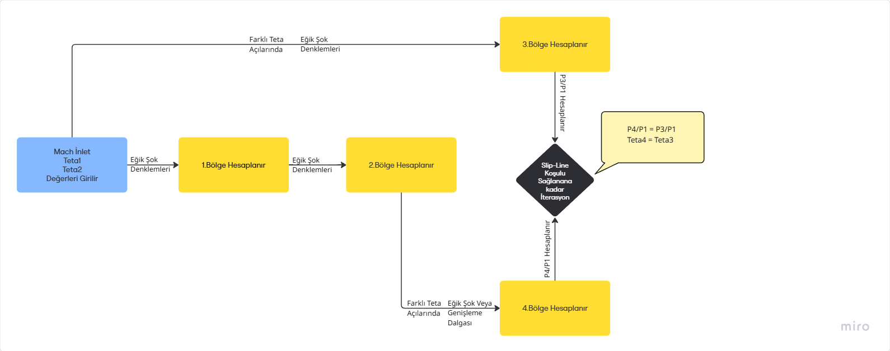

# Aynı Aileden Şok Dalgalarının Kesişmesi Analiz Aracı

## 1. Proje Amacı

Bu projenin temel amacı, aynı aileden süpersonik şok dalgalarının kesişmesini **nümerik yöntemlerle analiz etmek** ve sonuçları kullanıcıya sayısal veriler,grafik ve animasyonlarla sunmaktır.

Proje, süpersonik akışlarda şok dalgalarının kesişmesi sonucu oluşacak akışın davranışını anlamak, kesişim noktalarını belirlemek ve bu noktaların **basınç, sıcaklık ve yoğunluk** üzerindeki etkilerini analiz etmek için geliştirilmiştir.

CFD Analizi ile uzun süreler çözümleme yapmak yerine interaktif yapısı sayesinde bu çalışma ile oluşacak eğik şoklar,akış özellikleri kısa sürede hesaplanabilmektedir.

---

## 2. Kullanılan Yöntemler

### Eğik Şok Analizi
`Oblique_Shock_Solver.py` ile süpersonik akışta eğik şok sonrası akış özelliklerinin (Basınç,Sıcaklık vb) değişimleri hesaplanır.

### Prandtl-Meyer Genişleme Dalga Analizi
`Expansion_Wave_Solver.py` ile süpersonik akışta Prandtl-Meyer Genişleme Dalgası sonrası akış özelliklerinin  değişimleri hesaplanır.

### Aynı Aileden Şokların Kesişmesi
`Same_Family_Shock_Solver.py` ile şok dalgalarının kesişimi sonrası iteratif yöntemlerle çözüm yapılarak akış özellikleri hesaplanır.

Kodun Çalışma Yönteminin Akış Şeması İle Görselleştirilmesi

### Grafiksel Görselleştirme
`Graphics.py` kullanılarak basınç/sapma açısı diyagramları ve kesişim noktaları çizilir.

### Animasyon
`Animation.py` ile akış çizgileri **Turtle Graphics** kullanılarak animasyon şeklinde gösterilir.

### Kullanıcı Arayüzü
`Tkinter` ile kullanıcıdan giriş değerleri alınır ve sonuçlar **interaktif şekilde** gösterilir.

---

## 3. Kurulum ve Gereksinimler

- **Python 3.10** veya üstü
- Gerekli paketler:
   pip install numpy scipy matplotlib pillow

## 4. Dosya Yapısı
- project/
- │
- ├── Same_Family_Shock_Solver.py   # Şok kesişim hesaplamaları
- ├── Oblique_Shock_Solver.py       # Eğik şok analizi
- ├── Expansion_Wave_Solver.py      # Prandtl-Meyer genişleme dalgası
- ├── Graphics.py                   # Basınç vs Theta grafikleri
- ├── Animation.py                  # Akış animasyonu
- ├── GUI.py                        # Tkinter arayüzü
- ├── photo.png                     # GUI’de bölgeleri temsil eden resim.
- └── README.md                     # Proje açıklamaları

## 5. Kullanım

### 5.1 Arayüz Başlatma
`GUI.py` çalıştırıldığında **Tkinter tabanlı bir arayüz** açılır.

### 5.2 Girdi Parametreleri
- **Mach:** Giriş Mach sayısı  
- **Teta1:** İlk Rampa Açısı
- **Teta2:** İkinci Rampa için Artış Açısı

### 5.3 Hesaplama
- “Hesapla” butonuna basıldığında:
  - Şok dalgalarının kesişim noktaları **nümerik olarak çözülür**.
  - Her bölge için **Mach, basınç, sıcaklık ve yoğunluk oranları** hesaplanır.
  - Hesaplanan değerler tabloda görüntülenir.
  - Grafikler (`grafik.png` ve `grafik_zoomed.png`) oluşturulur.

### 5.4 Grafikler
- **Basınç-Sapma Açısı Diyagramı:** Kesişim noktalarını şok eğrileri ve genişleme dalgası eğrilerini gösterir.  
- **Zoomlu Grafik:** Kesişim noktasını yakınlaştırılmış olarak gösterir.

### 5.5 Animasyon
- “Akış Animasyonu” butonuna basıldığında, hesaplanan şok kesişim noktalarına göre **akış çizgileri ve şok dalgaları animasyonla** gösterilir.  
- Animasyon sayesinde **şokların yönü, akış hatları ve kesişim noktaları** görsel olarak incelenebilir.

---
## 6. Hata ve Uyarılar

- **Iteration Hatası:**  
  Giriş değerleri çok yüksek veya uygun değilse iterasyon sayısı yeterli olmayabilir.  
  **Çözüm:** `ITER_NUM` artırılabilir.

- **Ayrık Şok Uyarısı:**  
  Girilen theta açısı max theta değerini aşıyorsa ayrık şok oluşur ve kullanıcıya uyarı verilir:  
  `"Girdiğiniz theta açısı max theta açısından büyük, ayrık şok oluşur!"`

- **Dosya Bulunamadı:**  
  Grafik veya varsayılan resim dosyaları eksikse hata alınır.

- **Mach Sayısı:**
  Girilen Mach Sayısı 1'den küçük ise şok oluşmayacağı için kullanıcıya uyarı verir.

---

## 7. Proje Katkıları

- Nümerik şok analizi ve görselleştirme çalışmaları  
- Basınç-sapma açısı diyagramlarının çizimi  
- Animasyon ile akış ve şok davranışının görselleştirilmesi  
- Kullanıcı dostu Tkinter arayüzü
- Bu çalışmada, aynı aileden şok dalgalarının kesişmesinin ardından oluşacak akımın özelliklerini incelemek ve bu şok etkileşiminin ardındaki mekanizmayı daha iyi anlamak hedeflenmiştir.

## İletişim Bilgilerim
Programda eksik gördüğünüz durumlar veya hata,bug gibi sorunlar için iletişime geçebilirsiniz.
https://github.com/mvergili64
mehmetvergli43@gmail.com
